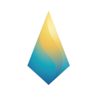
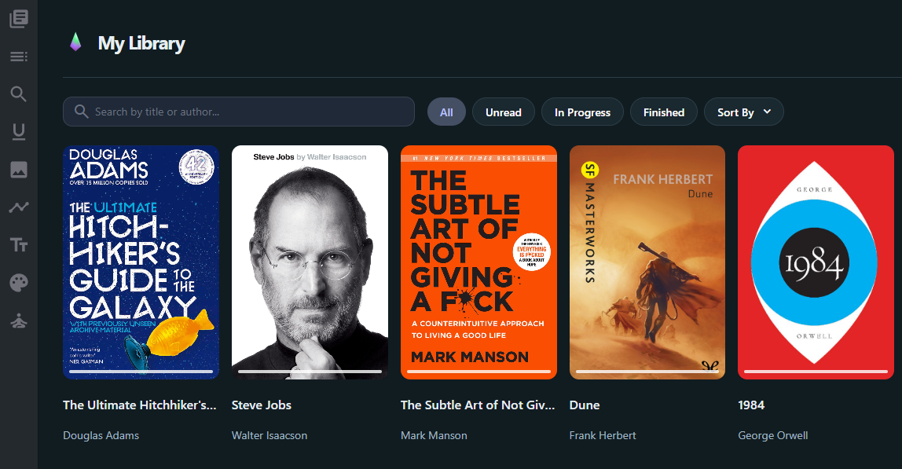
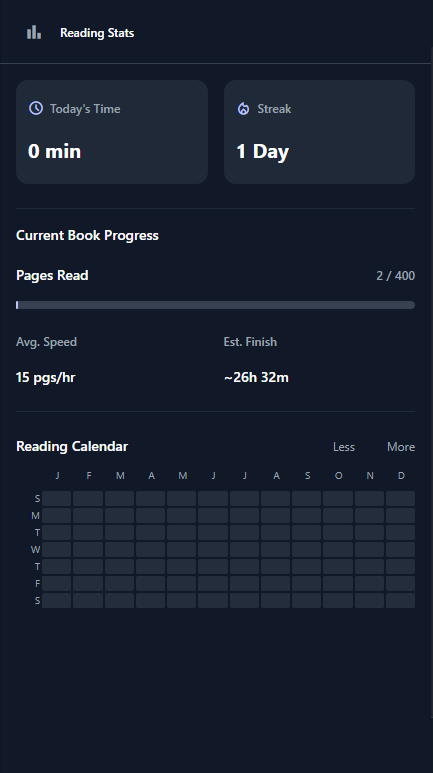
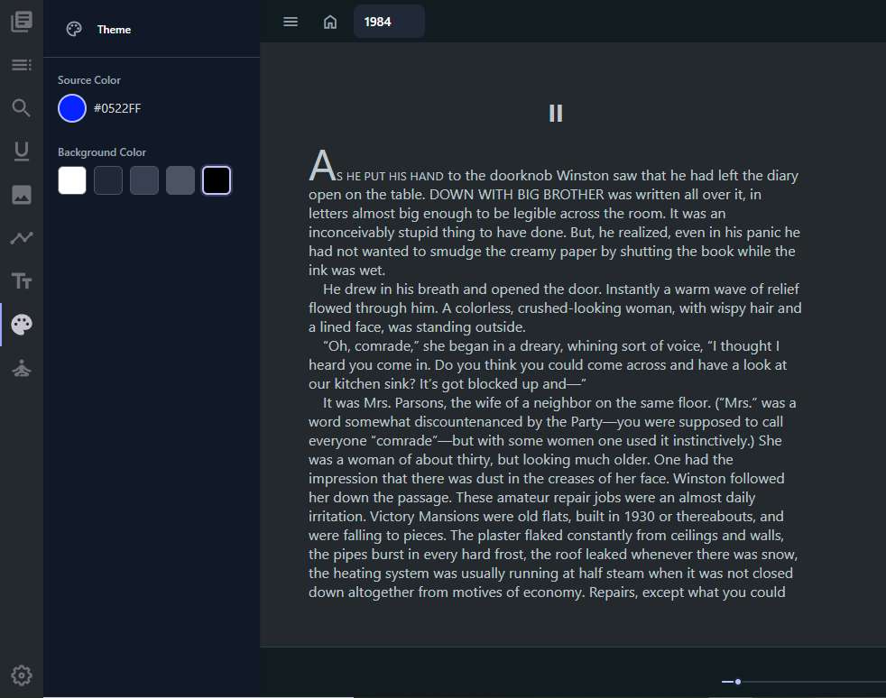

<div align="center">

  <!-- Logo -->
  

# Lumen Read

### A modern, immersive EPUB reader for productivity and focus.

  <!-- Badges -->
  <p>
    
    
    
    
  </p>

</div>

---

## 📸 Showcase

<div align="center">
  
  <!-- Screenshot 1 -->
  
  <p><em>A beautiful grid view for your collection.</em></p>

  <br />

  <!-- Screenshot 2 -->
  
  <p><em>Track your habits with heatmaps and streaks.</em></p>

  <br />

  <!-- Screenshot 3 -->
  
  <p><em>Eye-friendly reading at night.</em></p>

</div>

---

## ✨ Features

**Lumen Read** transforms your reading experience with features designed for flow:

- 🔥 **Reading Analytics:** Visualize your progress with a GitHub-style **Heatmap Calendar** and keep your momentum with **Streak tracking**.
- 🎨 **Dynamic Theming:** The entire UI (including the logo!) adapts to your chosen color, powered by Material Design 3.
- 🌑 **Smart Inversion:** A sophisticated dark mode that respects book imagery while saving your eyes.

---

## 🚀 Installation & Usage

### Development

To run the project locally:

```bash
# Install dependencies
pnpm install

# Start the development server
pnpm dev
```

### Loading in Chrome

1.  Build the extension:
    ```bash
    pnpm build:ext:chrome
    ```
2.  Open Chrome and navigate to `chrome://extensions`.
3.  Enable **Developer mode** (top right).
4.  Click **Load unpacked**.
5.  Select the `apps/extension/dist` directory.

---

## 🤝 Credits

**Lumen Read** is an enhanced fork of the [Flow](https://github.com/pacexy/flow) project.

> _Refactored and reimagined using **Google Antigravity & Gemini 3**._

---
